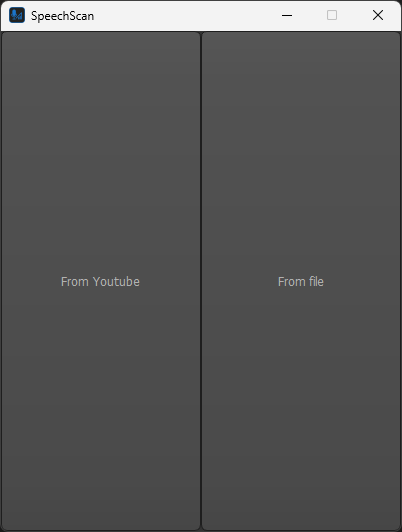
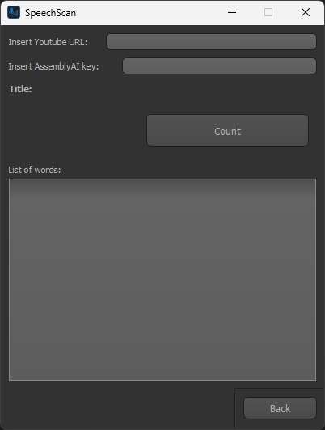
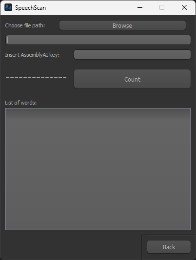
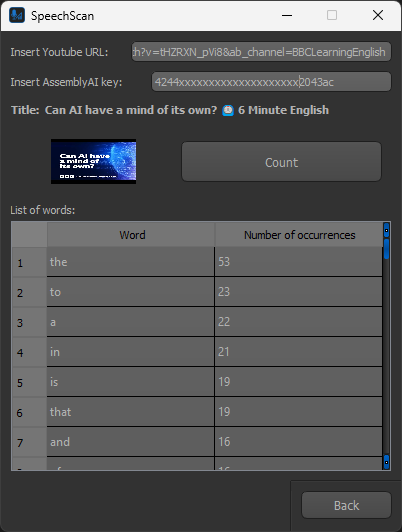

# SpeechScan

**SpeechScan** is a lightweight desktop application (PyQt5) that **transcribes audio recordings** using **AssemblyAI** and **counts word occurrences**.  
It supports two input modes:

- **Local file** (`.mp3` or other formats converted to `.mp3`),  
- **YouTube link** (audio automatically downloaded via `yt-dlp`).  

The app supports ~99 languages (English, Polish, German, French, Spanish, Italian, Portuguese, Russian, Japanese, Turkish…), automatically detected by AssemblyAI.

> **License:** `CC0-1.0` *(see [LICENSE](LICENSE) for details)*

---

## ⚙️ Technologies

### Runtime
- **Python** 3.12–3.14
- **PyQt5** – GUI
- **yt-dlp** – YouTube audio download
- **requests** – API communication
- **AssemblyAI API** – transcription

### Production / Development
- **Poetry** – dependency and package management
- **requirements.txt / requirements-dev.txt** – pip installation
- **mkdocs** – documentation (`docs/`, `mkdocs.yml`)
- **pre-commit** – auto-formatting and linting
- **CI/CD** – GitHub workflows (`.github/`)
- **logging_config** – colored logs with environment detection
- **PyInstaller** – `.exe` build (`SpeechScan.spec`)
- **mypy** – static type checking  
- **Black** – code formatting  
- **Ruff** – linting and style enforcement  

---

## 🧠 How It Works

1. **User input**  
   - Choose **File** (local audio) or **YouTube** (download audio via `yt-dlp`).  
   - Provide **AssemblyAI API key**.

2. **Audio processing**  
   - File is uploaded to AssemblyAI.  
   - A transcription job is created.  
   - The app polls the API until transcription completes.

3. **Text analysis**  
   - Transcript is cleaned and normalized.  
   - Word frequency table is generated.

4. **Presentation**  
   - Results are displayed in the GUI.  
   - Logs are saved (colored console, optional file logging).  

All long-running tasks (download, transcription, counting) run in **QThreads** to keep the UI responsive.

---

## 🗂️ Project Structure

```
## 🗂️ Project Structure

SpeechScan/
├─ .gitignore                        # Git ignore rules
├─ .pre-commit-config.yaml           # pre-commit hooks (Black, Ruff, mypy, etc.)
├─ LICENSE                           # License (CC0-1.0, see exceptions inside)
├─ mkdocs.yml                        # MkDocs site configuration
├─ poetry.lock                       # Poetry lockfile
├─ pyproject.toml                    # Poetry project config (deps, tools)
├─ README.md                         # Project readme
├─ requirements.txt                  # runtime dependencies
├─ requirements-dev.txt              # dev dependencies
├─ SpeechScan.spec                   # PyInstaller build specification
│
├─ .github/
│  └─ workflows/
│     ├─ build.yml                   # Build workflow (package/test build)
│     ├─ ci.yml                      # CI workflow (lint, tests)
│     └─ release.yml                 # Release workflow (PyInstaller, publish artifacts)
│
├─ docs/                             # Documentation (MkDocs site content)
│  ├─ index.md                       # Project introduction (homepage)
│  ├─ css/
│  │  ├─ mkdocstrings.css            # Styling for mkdocstrings plugin
│  │  └─ theme-variants.css          # Additional theme variants
│  └─ gen_ref_pages/                 # Scripts for generating API reference pages
│     ├─ config.py
│     ├─ context.py
│     ├─ generate.py
│     ├─ gen_ref_pages.py
│     ├─ helpers.py
│     └─ traverse.py
│
├─ screenshots/                      # Screenshots for README
│  ├─ main_screen.png                # Main screen
│  ├─ youtube_input.png              # YouTube input window
│  ├─ file_input.png                 # File input window
│  └─ result_screen.png              # Result view (YouTube transcription)
│
├─ src/speechscan/
│  ├─ __main__.py                    # Entry point (python -m speechscan)
│  ├─ app.py                         # QApplication init, style, UI setup
│  ├─ logging_config.py              # logging config (colors, ANSI detection)
│  │
│  ├─ assets/
│  │  ├─ img/
│  │  │  ├─ icon.ico                 # Windows icon
│  │  │  ├─ icon.png                 # App icon
│  │  │  └─ loading.gif              # Loading animation
│  │  └─ style/
│  │     └─ style.qss                # Qt stylesheet
│  │
│  ├─ services/
│  │  ├─ text/
│  │  │  └─ count_words.py           # Transcript cleanup + word frequency counting
│  │  └─ transcription/
│  │     └─ transcribe_audio.py      # AssemblyAI client (upload, poll, fetch text)
│  │
│  ├─ threads/
│  │  ├─ check_url_thread.py         # YouTube URL validator
│  │  ├─ count_words_thread.py       # Run counting in worker thread
│  │  └─ download_video_thread.py    # Download YouTube audio (yt-dlp)
│  │
│  ├─ ui/
│  │  ├─ file_window.py              # File input window
│  │  ├─ start_window.py             # Start screen
│  │  ├─ youtube_window.py           # YouTube input window
│  │  └─ views/
│  │     ├─ file_window.ui           # Qt Designer layout (file mode)
│  │     ├─ open_window.ui           # Qt Designer layout (start screen)
│  │     └─ youtube_window.ui        # Qt Designer layout (YouTube mode)
│  │
│  └─ utils/
│     └─ paths.py                    # Resource paths (dev vs exe)

```

---

## 🔧 Installation

### Option A — pip

**Users (runtime only):**

```bash
python -m venv .venv
source .venv/bin/activate      # Linux/macOS
.venv\Scripts\activate         # Windows

pip install --upgrade pip
pip install -r requirements.txt
pip install -e .
```

**Developers (runtime + dev):**

```bash
pip install -r requirements.txt -r requirements-dev.txt
pip install -e .
```

---

### Option B — Poetry

**Users (without dev):**

```bash
poetry install --without dev
poetry run speechscan
```

**Developers (with dev):**

```bash
poetry install
poetry run speechscan
```

---

## 📚 Documentation

Built with **mkdocs**.

```bash
mkdocs serve      # local preview (http://127.0.0.1:8000)
mkdocs build      # build into site/
```

---

## 🏗️ Build Executable

To build a Windows `.exe` with PyInstaller:

```bash
pyinstaller SpeechScan.spec
```

Resulting binary will be in `dist/`.

---

## 🛠️ Development Tools

This project uses additional tools to keep the codebase clean and consistent:

### Type checking
```bash
mypy src/
```

### Linting
```bash
ruff check src/
```

### Auto-formatting
```bash
black src/
```

### Run all pre-commit hooks locally
```bash
pre-commit run --all-files
```

---

## ▶️ Running the App

### From source

```bash
python -m speechscan
```

### With Poetry

```bash
poetry run speechscan
```

### After installation

```bash
speechscan
```

---

## 🔑 AssemblyAI API Key

You need an **AssemblyAI API key**.  
Create it for free at [https://www.assemblyai.com](https://www.assemblyai.com) (account needed).

---

## 💻 Usage

1. Launch the app (`speechscan`).  
2. Choose **File** or **YouTube** mode.  
3. Provide your AssemblyAI API key (if prompted).  
4. Click **Count** and wait for the transcription.  
5. View the word frequency table in the GUI.  

---

---

## 🖼️ Screenshots

Main screen:  


YouTube input:  


File input:  


Result view (YouTube transcription):  


---


## 📜 License

Released under **CC0-1.0 (public domain)**. You may copy, modify, distribute, and use it commercially without asking for permission.  
⚠️ Note: not all files in the repository are covered by CC0 — see [LICENSE](LICENSE).